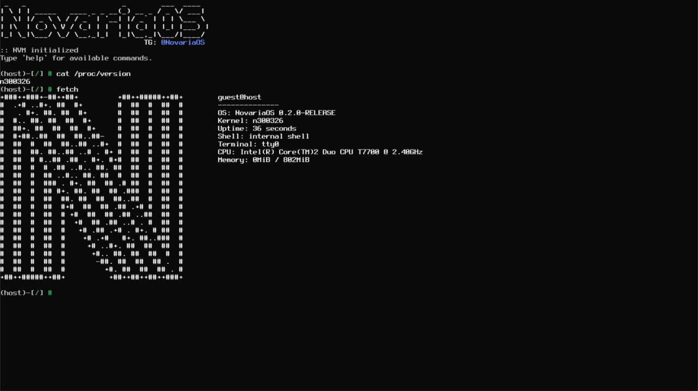

# NovariaOS

    
    
    
    
    

  
 
  <em>NovariaOS booting on QEMU (x86_64)</em>

---

## 📌 Introduction

> [!Warning] 
> NovariaOS is an experimental research operating system.
> It is **not stable**, **not secure**, till.
> 
> Expect breaking changes. Do not use on production hardware.

**NovariaOS** is not a Linux distro or fork of something.. It is a **ground-up implementation** of a capability-based operating system with a built-in virtual machine (NVM) for permanently eliminate incompatibility between user software and hardware
We are not trying to replace anything. We are exploring an alternative path.

---

## ⚙️ Features

| Area         | Status      | Notes |
|--------------|-------------|-------|
| **x86_64**   | ✅ Boot     | Limine, IDT, Initial setup |
| **Memory**   | 🟡 Partial  | Buddy+slab(WIP) allocator |
| **NVM**      | ✅ Work     | Stack machine, 27 opcodes, no JIT |
| **CAPS**     | ✅ Work     | Capability lists, runtime checks |
| **Filesystem** | ✅ Work   | In-memory r/w, VFS, iso9660 (planned: ext2 and FAT32) |
| **Userspace**  | ❌ None   | Planned: Nutils (nsh and basic commands, like busybox) |

---

## 🚧 Limitations (aka "We know")

- No SMP (single core only for now)
- No userspace yet (shell and basic utils built-in the kernel) — yes, we know it's bad. 
- No networking
- NVM is not JIT-compiled, interpretation is slow
- CAPS is not integrated yet (every program run with CAP_ALL)

---

## 📊 "Benchmarks"

| Test | Result | Note |
|------|--------|------|
| Boot time (QEMU) | ~0.3s | From Limine to kmain |
| NVM 10⁹ adds | 2.4s | Interpreted, no optimizations |
| Panics triggered | 10100 | In last 30 days |

---

## 💬 Community

We have a [Telegram channel](https://t.me/NovariaOS).  
We don't bite. We discuss stupid ideas, breaking changes, and occasionally working code.

If you want to contribute:
- Open an issue
- Fork and hack
- Ask questions in Telegram first — we'll help you not to waste time

---

## 📜 License

GPL-3.0 — because sharing is caring.

---

## 🕯️ Nostalgia

*In memory of the OSdev scene of the early 2000s — We are still here. We still write assembly. We still triple-fault for fun.*
