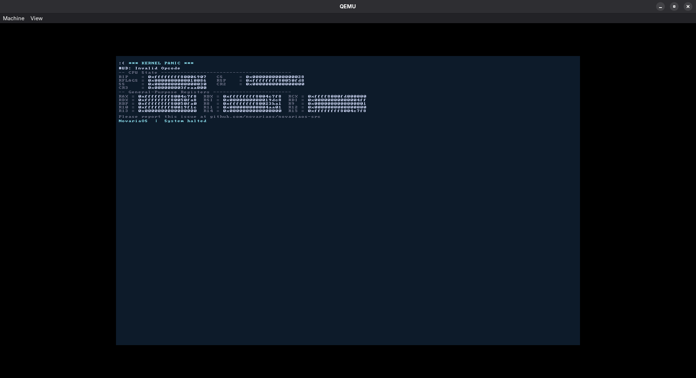

# Kernel Panic

When the kernel encounters a fatal, unrecoverable error it displays a panic screen and halts all CPUs. The system does **not** reboot — it halts until manually power-cycled or reset.

## Triggering a panic

There are two ways a panic is raised:

### 1. Explicit call

```c
#include <core/arch/panic.h>

panic("message");
```

Disables interrupts, prints the message, then loops on `hlt`.

### 2. CPU exception

Any unhandled CPU exception (page fault, GPF, double fault, etc.) automatically triggers a panic via the IDT exception handlers installed by `idt_init()`.

## Panic screen



The screen is rendered directly to the linear framebuffer without going through any HAL layer, so it works even if the normal display stack has faulted. Output is also mirrored to the serial port (COM1) for headless/log-based debugging.

### Fields displayed

| Field    | Source                                          |
|----------|-------------------------------------------------|
| `RIP`    | Instruction pointer at the fault                |
| `CS`     | Code segment selector                           |
| `RFLAGS` | CPU flags register                              |
| `RSP`    | Stack pointer at the fault                      |
| `SS`     | Stack segment selector                          |
| `CR2`    | Faulting virtual address (page fault address)   |
| `CR3`    | Page table base (physical address)              |
| `ERR`    | Error code (only for exceptions that push one)  |
| `RAX`–`R15` | All general-purpose registers at fault time |

## Handled CPU exceptions

| Vector | Mnemonic | Description                   | Error code |
|--------|----------|-------------------------------|------------|
| `0x00` | `#DE`    | Divide Error                  | no         |
| `0x01` | `#DB`    | Debug Exception               | no         |
| `0x02` | —        | Non-Maskable Interrupt        | no         |
| `0x03` | `#BP`    | Breakpoint                    | no         |
| `0x04` | `#OF`    | Overflow                      | no         |
| `0x05` | `#BR`    | Bound Range Exceeded          | no         |
| `0x06` | `#UD`    | Invalid Opcode                | no         |
| `0x07` | `#NM`    | Device Not Available          | no         |
| `0x08` | `#DF`    | Double Fault                  | yes (0)    |
| `0x0A` | `#TS`    | Invalid TSS                   | yes        |
| `0x0B` | `#NP`    | Segment Not Present           | yes        |
| `0x0C` | `#SS`    | Stack-Segment Fault           | yes        |
| `0x0D` | `#GP`    | General Protection Fault      | yes        |
| `0x0E` | `#PF`    | Page Fault                    | yes        |
| `0x10` | `#MF`    | x87 Floating-Point Exception  | no         |
| `0x11` | `#AC`    | Alignment Check               | yes        |
| `0x12` | `#MC`    | Machine Check                 | no         |
| `0x13` | `#XF`    | SIMD Floating-Point Exception | no         |

Vectors not in this table receive the **default handler**: sends EOI to the LAPIC and returns.

## IDT initialisation

`idt_init()` must be called before any code that could fault or use interrupts. In `kernel.c` it is called early inside `early_init()`, before the memory manager and all drivers.

```c
static void early_init(void) {
    init_fb();
    idt_init();          // first: catch any fault immediately
    init_serial();
    memory_manager_init();
}
```

`panic_fb_init()` is called at the end of `init_fb()` to hand the framebuffer address and dimensions to the panic handler. If `init_fb()` has not yet run when a fault fires, the panic output still reaches the serial port.

## SMP: AP cores

Each Application Processor calls `idt_load()` at the start of `ap_entry()` so the IDT is active on every core before any work runs.

## Installing custom handlers

Drivers can register their own interrupt handler for any vector (e.g. MSI):

```c
#include <core/arch/idt.h>

// handler must match __attribute__((interrupt)) signature
idt_install_handler(0x41, my_irq_handler);
```

The handler replaces whatever was previously installed at that vector.

## Page fault error code bits

The `ERR` field for `#PF` (vector `0x0E`) is a bitmask:

| Bit | Meaning when set                    |
|-----|-------------------------------------|
| 0   | Protection violation (not present if clear) |
| 1   | Write access                        |
| 2   | User-mode access                    |
| 3   | Reserved bit set in page table      |
| 4   | Instruction fetch                   |

## Reporting

The panic screen instructs users to report issues at:
`github.com/novariaos/novariaos-src`

## Implementation

| File                        | Role                                                                 |
|-----------------------------|----------------------------------------------------------------------|
| `core/arch/idt.c`           | IDT table, exception stubs, register capture, direct FB panic output |
| `include/core/arch/idt.h`   | Structs (`idt_entry_t`, `idtr_t`, `interrupt_frame_t`), declarations |
| `include/core/arch/panic.h` | `panic()` inline helper for explicit panics                          |
| `core/kernel/vge/fb_render.c` | Calls `panic_fb_init()` after framebuffer is set up               |
